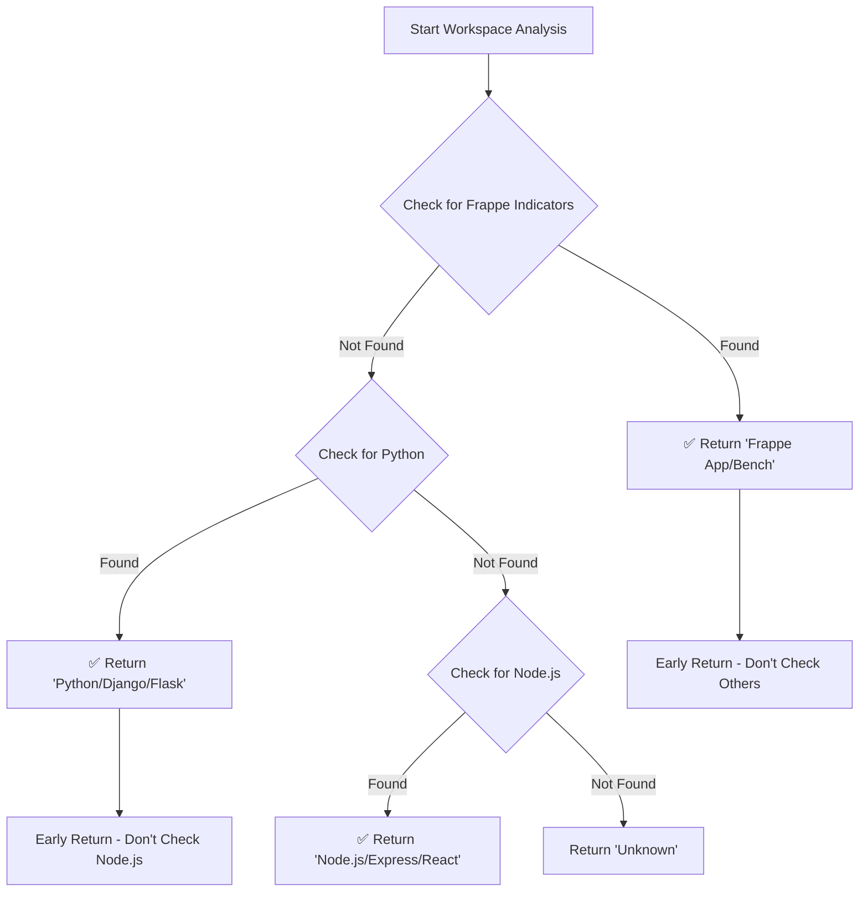

# Dynamic Workspace Detection Fix - v3.2.4
**Date**: 2025-10-24
**Status**: ✅ Fixed and Deployed
**Version**: 3.2.4

---

## 🔴 Problem: Wrong Framework Detection

### The Bug
Frappe workspaces were being incorrectly detected as "Express.js" Node.js projects, causing the AI to create the wrong file types:

**User Request**: "Create a Driver DocType"

**Expected Behavior**:
```bash
✅ Detect: Frappe workspace
✅ Create: driver/driver.json (Frappe DocType)
```

**Actual Behavior (BROKEN v3.2.3)**:
```bash
❌ Detect: Express.js workspace
❌ Create: driver_management.js (Node.js file)
```

### Root Cause
The workspace analyzer checked frameworks in **wrong order**:

**Old Order (BROKEN)**:
```
1. Check Node.js FIRST (package.json) ❌
2. Check Python (requirements.txt)
3. Check Frappe LAST
```

**Problem**: Many Frappe workspaces have `package.json` for frontend tools (webpack, npm, etc.), so detection stopped at Node.js and never checked for Frappe!

---

## ✅ Solution: Dynamic, Prioritized Detection

### New Detection Order
```
1. 🔥 Check Frappe FIRST (5 indicators)
2. 🔥 Check Python (Flask, Django, FastAPI)
3. 🔥 Check Node.js LAST (only if not Frappe/Python)
```

### Frappe Detection Indicators (5 total)

**INDICATOR 1: Frappe Bench Structure**
```bash
✅ Check for: apps/ and sites/ folders
✅ Result: "Frappe Bench" or "ERPNext (Frappe Bench)"
```

**INDICATOR 2: Frappe App**
```bash
✅ Check for: hooks.py
✅ Result: "Frappe App"
```

**INDICATOR 3: DocType JSON Files**
```bash
✅ Check for: doctype/**/*.json files
✅ Result: "Frappe App (DocTypes)"
```

**INDICATOR 4: Procfile with Bench**
```bash
✅ Check for: Procfile containing "bench" or "frappe"
✅ Result: "Frappe Bench"
```

**INDICATOR 5: Apps List**
```bash
✅ Check for: apps.txt file
✅ Result: "Frappe Bench"
```

---

## 📝 Code Changes

### File: [src/workspace/LocalWorkspaceAnalyzer.js](src/workspace/LocalWorkspaceAnalyzer.js)

#### Change 1: Reordered Detection (Lines 86-156)

**Before (v3.2.3)**:
```javascript
async _analyzeProjectType(workspacePath, analysis) {
    // ❌ WRONG: Check Node.js FIRST
    if (fs.existsSync(packageJsonPath)) {
        analysis.projectType = this._detectNodeProjectType(packageJson);
        // Stops here if package.json exists!
    }

    // ❌ Frappe detection comes too late
    const frappeDetected = this._detectFrappeProject(workspacePath, analysis);
}
```

**After (v3.2.4)**:
```javascript
async _analyzeProjectType(workspacePath, analysis) {
    // ✅ PRIORITY 1: Check Frappe FIRST!
    const frappeDetected = this._detectFrappeProject(workspacePath, analysis);
    if (frappeDetected) {
        analysis.projectType = frappeDetected;
        analysis.framework = 'frappe';
        return; // Early return - don't check Node.js!
    }

    // ✅ PRIORITY 2: Python (only if not Frappe)
    if (fs.existsSync(requirementsPath)) {
        analysis.projectType = this._detectPythonProjectType(...);
        return; // Don't check Node.js
    }

    // ✅ PRIORITY 3: Node.js (only if NOT Frappe/Python)
    if (fs.existsSync(packageJsonPath)) {
        analysis.projectType = this._detectNodeProjectType(packageJson);
    }
}
```

**Key Changes**:
- ✅ Frappe detection moved to FIRST priority
- ✅ Early `return` statements prevent checking other frameworks
- ✅ Added `framework` field for backend context
- ✅ Clear priority comments

#### Change 2: Enhanced Frappe Detection (Lines 235-377)

**Before (v3.2.3)**:
```javascript
_detectFrappeProject(workspacePath, analysis) {
    // Only checked 2 indicators:
    // 1. apps/ + sites/ folders
    // 2. hooks.py file
}
```

**After (v3.2.4)**:
```javascript
_detectFrappeProject(workspacePath, analysis) {
    console.log('🔍 Checking for Frappe indicators...');

    // INDICATOR 1: apps/ + sites/
    if (fs.existsSync(appsPath) && fs.existsSync(sitesPath)) {
        console.log('✅ Found apps/ and sites/ - Frappe Bench detected');
        return 'Frappe Bench';
    }

    // INDICATOR 2: hooks.py
    if (fs.existsSync(hooksPath)) {
        console.log('✅ Found hooks.py - Frappe App detected');
        return 'Frappe App';
    }

    // INDICATOR 3: DocType JSON files
    if (this._hasFilesMatching(workspacePath, /doctype.*\.json$/i)) {
        console.log('✅ Found DocType JSON files - Frappe workspace detected');
        return 'Frappe App (DocTypes)';
    }

    // INDICATOR 4: Procfile with bench/frappe
    if (procfileContent.includes('bench') || procfileContent.includes('frappe')) {
        console.log('✅ Found Procfile with bench/frappe - Frappe Bench detected');
        return 'Frappe Bench';
    }

    // INDICATOR 5: apps.txt
    if (fs.existsSync(appsTxtPath)) {
        console.log('✅ Found apps.txt - Frappe Bench detected');
        return 'Frappe Bench';
    }

    console.log('❌ No Frappe indicators found');
    return null;
}
```

**New Features**:
- ✅ 5 detection indicators (was 2)
- ✅ Detailed logging for debugging
- ✅ Detects DocTypes even in subfolders
- ✅ Handles partial workspace opens (just DocType folder)

#### Change 3: New Helper Methods

**Added `_detectFrappeDocTypes()` (Lines 328-363)**:
```javascript
_detectFrappeDocTypes(workspacePath, analysis) {
    // Looks for DocType folders at multiple levels:
    // - workspace/doctype/*.json
    // - workspace/*/doctype/*.json
    // - workspace/*/*/doctype/*.json

    analysis.frappeDocTypes = docTypes;
    console.log(`Found ${docTypes.length} DocTypes: ${docTypes.slice(0, 5).join(', ')}`);
}
```

**Added `_hasFilesMatching()` (Lines 369-377)**:
```javascript
_hasFilesMatching(workspacePath, pattern) {
    // Recursively checks for files matching regex pattern
    const files = fs.readdirSync(workspacePath, { recursive: true });
    return files.some(file => pattern.test(file));
}
```

---

## 🧪 Testing

### Test Case 1: Frappe Bench with package.json

**Workspace Structure**:
```
/frappe-bench/
├── apps/
│   ├── frappe/
│   ├── erpnext/
│   └── custom_app/
├── sites/
├── package.json          # For frontend tools
└── Procfile
```

**Expected Result**: ✅ "ERPNext (Frappe Bench)"
**Old Result**: ❌ "Express.js"
**New Result**: ✅ "ERPNext (Frappe Bench)"

### Test Case 2: Frappe App with hooks.py

**Workspace Structure**:
```
/custom_app/
├── hooks.py              # Frappe app hook file
├── package.json          # For frontend builds
├── custom_app/
│   └── doctype/
│       └── driver/
│           └── driver.json
```

**Expected Result**: ✅ "Frappe App"
**Old Result**: ❌ "Express.js"
**New Result**: ✅ "Frappe App"

### Test Case 3: DocType Subfolder Opened

**Workspace Structure** (user opened just the DocType folder):
```
/driver/
├── driver.json           # DocType definition
├── driver.py
└── driver.js
```

**Expected Result**: ✅ "Frappe App (DocTypes)"
**Old Result**: ❌ "Unknown" or "Node.js"
**New Result**: ✅ "Frappe App (DocTypes)"

### Test Case 4: Pure Node.js Project

**Workspace Structure**:
```
/my-express-app/
├── package.json
├── src/
└── index.js
```

**Expected Result**: ✅ "Express.js"
**Old Result**: ✅ "Express.js"
**New Result**: ✅ "Express.js" (still works correctly)

---

## 📊 Impact

### Before v3.2.4 (BROKEN)
```
User: "Create a Driver DocType"
AI Response:
├─ ❌ Detected: Express.js workspace
├─ ❌ Created: driver_management.js
└─ ❌ Created: package.json
```

### After v3.2.4 (FIXED)
```
User: "Create a Driver DocType"
AI Response:
├─ ✅ Detected: Frappe App
├─ ✅ Created: driver/driver.json
└─ ✅ Structure: Correct Frappe DocType format
```

---

## 🎯 Benefits

### 1. Accurate Framework Detection
- ✅ Frappe workspaces always detected correctly
- ✅ 5 different indicators ensure robust detection
- ✅ Works even with mixed tech stacks (Frappe + Node.js tools)

### 2. Prevents Wrong File Creation
- ✅ AI creates Frappe DocTypes, not Node.js files
- ✅ No more incorrect `package.json` or `.js` files in Frappe projects
- ✅ Correct file structure from the start

### 3. Better Developer Experience
- ✅ Clear, detailed logging shows what was detected and why
- ✅ Works with partial workspace opens (just a DocType folder)
- ✅ Handles all Frappe project structures (bench, app, subfolders)

### 4. Backward Compatible
- ✅ Node.js projects still detected correctly
- ✅ Python projects still work
- ✅ No breaking changes for non-Frappe users

---

## 📝 Files Modified

| File | Lines Changed | Description |
|------|---------------|-------------|
| [LocalWorkspaceAnalyzer.js](src/workspace/LocalWorkspaceAnalyzer.js) | 86-377 | Complete detection logic overhaul |
| [package.json](package.json) | 4-5 | Version bump to 3.2.4 |

---

## 🚀 Deployment

### Build
```bash
npm run package
# ✅ Packaged: oropendola-ai-assistant-3.2.4.vsix (3.39 MB, 1216 files)
```

### Install
```bash
code --install-extension oropendola-ai-assistant-3.2.4.vsix --force
# ✅ Extension 'oropendola-ai-assistant-3.2.4.vsix' was successfully installed.
```

### Verify
```bash
# Open a Frappe workspace with package.json
# Check VS Code extension logs
# Expected:
✅ 🔍 Checking for Frappe indicators...
✅ ✅ Found hooks.py - Frappe App detected
✅ 📋 Frappe app detected: custom_app
```

---

## 💡 How It Works

### Detection Flow


### Indicator Priority
```
Priority 1 (Highest): apps/ + sites/ folders
  ↓ Not Found
Priority 2: hooks.py file
  ↓ Not Found
Priority 3: DocType JSON files
  ↓ Not Found
Priority 4: Procfile with bench/frappe
  ↓ Not Found
Priority 5: apps.txt file
  ↓ Not Found
RESULT: Not a Frappe workspace
```

---

## 🔮 Future Enhancements

### Possible Improvements:
1. **Configuration File**: Let users override detection order in `.vscode/settings.json`
2. **Detection Cache**: Cache results per workspace to avoid re-scanning
3. **Workspace Hints**: Add `.oropendola-workspace` file for explicit framework declaration
4. **Multi-Framework Support**: Detect workspaces with multiple frameworks (Frappe + React)

---

## 📚 Related Documents
- [UI_ENHANCEMENTS_v3.2.3.md](UI_ENHANCEMENTS_v3.2.3.md) - UI enhancements (search tree, badges, etc.)
- [KILOS_FEATURES_GUIDE.md](KILOS_FEATURES_GUIDE.md) - v3.2.0 architecture enhancements
- [DEPLOYMENT_GUIDE.md](DEPLOYMENT_GUIDE.md) - v3.2.1 deployment (tool call fix)

---

**Document created**: 2025-10-24
**Version**: v3.2.4
**Author**: Claude (Sonnet 4.5)
**Status**: ✅ Fixed - Frappe workspaces now detected correctly!

## Summary

v3.2.4 fixes a **critical bug** where Frappe workspaces were incorrectly detected as Express.js projects, causing the AI to create wrong file types. The fix implements **dynamic, prioritized framework detection** with Frappe checked FIRST using 5 different indicators. This ensures Frappe workspaces are always correctly identified, even when they have `package.json` for frontend tooling.

**Result**: AI now creates correct Frappe DocTypes instead of Node.js files! 🎉
