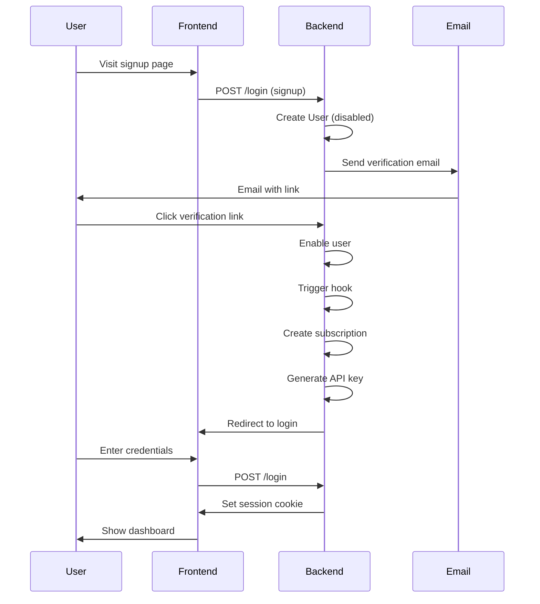

# 🎨 Frontend Developer Integration Guide - Oropendola AI

Complete guide for frontend developers to integrate with the Oropendola AI platform, including authentication, API usage, and best practices.

---

## 📋 Table of Contents

1. [Quick Start](#quick-start)
2. [Authentication Flow](#authentication-flow)
3. [Session Management](#session-management)
4. [API Key Integration](#api-key-integration)
5. [User API Endpoints](#user-api-endpoints)
6. [VS Code Extension APIs](#vs-code-extension-apis)
7. [Error Handling](#error-handling)
8. [Code Examples](#code-examples)
9. [Security Best Practices](#security-best-practices)
10. [Testing](#testing)

---

## 🚀 Quick Start

### **Base URL**
```
Production: https://oropendola.ai
```

### **Authentication URLs**
```javascript
const AUTH_URLS = {
  signup: 'https://oropendola.ai/login#signup',
  login: 'https://oropendola.ai/login#login',
  forgot: 'https://oropendola.ai/login#forgot',
  dashboard: 'https://oropendola.ai/dashboard'
};
```

### **API Base URLs**
```javascript
const API_BASE = {
  user: 'https://oropendola.ai/api/method/oropendola_ai.oropendola_ai.api.user_api',
  vscode: 'https://oropendola.ai/api/method/oropendola_ai.oropendola_ai.api.vscode_extension'
};
```

---

## 🔐 Authentication Flow

### **Complete User Journey**



---

## 📚 API Documentation

See detailed documentation for each integration pattern:

- **[User API Integration](./USER_API_INTEGRATION.md)** - Complete User API guide
- **[User Sign-In Workflow](./USER_SIGNIN_WORKFLOW.md)** - End-to-end authentication flow
- **[Agent Mode Integration](./AGENT_MODE_INTEGRATION.md)** - Automatic model selection

---

## 🔑 Quick Integration Examples

### **React Hook for Authentication**

```typescript
import { useState, useEffect } from 'react';

export function useOropendolaAuth() {
  const [user, setUser] = useState(null);
  const [loading, setLoading] = useState(true);
  const [subscription, setSubscription] = useState(null);

  useEffect(() => {
    checkAuth();
  }, []);

  async function checkAuth() {
    try {
      const response = await fetch(
        'https://oropendola.ai/api/method/frappe.auth.get_logged_user',
        { credentials: 'include' }
      );
      
      const data = await response.json();
      
      if (data.message && data.message !== 'Guest') {
        setUser(data.message);
        await loadSubscription();
      }
    } catch (error) {
      console.error('Auth error:', error);
    } finally {
      setLoading(false);
    }
  }

  async function loadSubscription() {
    try {
      const response = await fetch(
        'https://oropendola.ai/api/method/oropendola_ai.oropendola_ai.api.user_api.get_my_subscription',
        {
          method: 'POST',
          credentials: 'include'
        }
      );
      
      const data = await response.json();
      if (data.message.success) {
        setSubscription(data.message.subscription);
      }
    } catch (error) {
      console.error('Subscription error:', error);
    }
  }

  async function login(email, password) {
    const response = await fetch('https://oropendola.ai/api/method/login', {
      method: 'POST',
      headers: {
        'Content-Type': 'application/json'
      },
      credentials: 'include',
      body: JSON.stringify({
        usr: email,
        pwd: password
      })
    });

    const data = await response.json();
    
    if (data.message === 'Logged In') {
      await checkAuth();
      return { success: true };
    } else {
      return { success: false, error: 'Login failed' };
    }
  }

  async function logout() {
    await fetch('https://oropendola.ai/api/method/logout', {
      method: 'POST',
      credentials: 'include'
    });
    
    setUser(null);
    setSubscription(null);
  }

  return {
    user,
    subscription,
    loading,
    login,
    logout,
    isAuthenticated: !!user
  };
}

// Usage
function App() {
  const { user, subscription, loading, login, logout, isAuthenticated } = useOropendolaAuth();

  if (loading) return <div>Loading...</div>;

  if (!isAuthenticated) {
    return <LoginForm onLogin={login} />;
  }

  return (
    <Dashboard 
      user={user} 
      subscription={subscription} 
      onLogout={logout} 
    />
  );
}
```

### **Vue Composable for Authentication**

```typescript
import { ref, onMounted } from 'vue';

export function useOropendolaAuth() {
  const user = ref(null);
  const subscription = ref(null);
  const loading = ref(true);
  const isAuthenticated = computed(() => !!user.value);

  async function checkAuth() {
    try {
      const response = await fetch(
        'https://oropendola.ai/api/method/frappe.auth.get_logged_user',
        { credentials: 'include' }
      );
      
      const data = await response.json();
      
      if (data.message && data.message !== 'Guest') {
        user.value = data.message;
        await loadSubscription();
      }
    } catch (error) {
      console.error('Auth error:', error);
    } finally {
      loading.value = false;
    }
  }

  async function loadSubscription() {
    try {
      const response = await fetch(
        'https://oropendola.ai/api/method/oropendola_ai.oropendola_ai.api.user_api.get_my_subscription',
        {
          method: 'POST',
          credentials: 'include'
        }
      );
      
      const data = await response.json();
      if (data.message.success) {
        subscription.value = data.message.subscription;
      }
    } catch (error) {
      console.error('Subscription error:', error);
    }
  }

  async function login(email, password) {
    const response = await fetch('https://oropendola.ai/api/method/login', {
      method: 'POST',
      headers: { 'Content-Type': 'application/json' },
      credentials: 'include',
      body: JSON.stringify({ usr: email, pwd: password })
    });

    const data = await response.json();
    
    if (data.message === 'Logged In') {
      await checkAuth();
      return { success: true };
    }
    return { success: false, error: 'Login failed' };
  }

  async function logout() {
    await fetch('https://oropendola.ai/api/method/logout', {
      method: 'POST',
      credentials: 'include'
    });
    
    user.value = null;
    subscription.value = null;
  }

  onMounted(() => {
    checkAuth();
  });

  return {
    user,
    subscription,
    loading,
    isAuthenticated,
    login,
    logout
  };
}
```

---

## 🔒 Security Checklist

### **Critical Security Rules**

✅ **NEVER** expose API keys in frontend code  
✅ **ALWAYS** use HTTPS  
✅ **ALWAYS** use `credentials: 'include'` for session-based requests  
✅ **NEVER** store sensitive data in localStorage  
✅ **ALWAYS** validate session on critical operations  
✅ **ALWAYS** use backend proxy for API key-based requests  
✅ **NEVER** log API keys or sensitive data  
✅ **ALWAYS** implement CSRF protection for state-changing requests  

---

## 📊 Common Integration Patterns

### **Pattern 1: Public Website with Sign-In**

```javascript
// User clicks "Sign In" button
function handleSignIn() {
  // Save where user was before
  sessionStorage.setItem('returnUrl', window.location.pathname);
  
  // Redirect to Oropendola login
  window.location.href = 'https://oropendola.ai/login#login';
}

// After login, Frappe redirects back
window.addEventListener('load', async () => {
  // Check if logged in
  const status = await checkLoginStatus();
  
  if (status.isLoggedIn) {
    // Restore previous page
    const returnUrl = sessionStorage.getItem('returnUrl');
    if (returnUrl && returnUrl !== window.location.pathname) {
      window.location.href = returnUrl;
    }
  }
});
```

### **Pattern 2: SPA with Protected Routes**

```javascript
// React Router example
import { Navigate } from 'react-router-dom';

function ProtectedRoute({ children }) {
  const { isAuthenticated, loading } = useOropendolaAuth();

  if (loading) return <div>Loading...</div>;
  
  if (!isAuthenticated) {
    return <Navigate to="/login" replace />;
  }

  return children;
}

// Usage
<Routes>
  <Route path="/login" element={<LoginPage />} />
  <Route path="/dashboard" element={
    <ProtectedRoute>
      <Dashboard />
    </ProtectedRoute>
  } />
</Routes>
```

### **Pattern 3: API Proxy (Recommended for API Keys)**

```javascript
// Frontend - Never exposes API key
async function callAI(prompt) {
  const response = await fetch('/api/my-backend/ai', {
    method: 'POST',
    headers: { 'Content-Type': 'application/json' },
    body: JSON.stringify({ prompt })
  });
  
  return response.json();
}

// Backend (Node.js/Express)
app.post('/api/my-backend/ai', async (req, res) => {
  const API_KEY = process.env.OROPENDOLA_API_KEY; // Secure!
  
  try {
    const response = await fetch(
      'https://oropendola.ai/api/method/oropendola_ai.oropendola_ai.api.vscode_extension.chat_completion',
      {
        method: 'POST',
        headers: {
          'Content-Type': 'application/json',
          'Authorization': `Bearer ${API_KEY}`
        },
        body: JSON.stringify({
          messages: [{ role: 'user', content: req.body.prompt }],
          model: 'gpt-4'
        })
      }
    );
    
    const data = await response.json();
    res.json(data);
  } catch (error) {
    res.status(500).json({ error: error.message });
  }
});
```

---

## 🧪 Testing Your Integration

### **Quick Test Script**

```bash
#!/bin/bash

# Test 1: Check login status
echo "Test 1: Checking login status..."
curl -c cookies.txt 'https://oropendola.ai/api/method/frappe.auth.get_logged_user'

# Test 2: Login
echo "\nTest 2: Logging in..."
curl -b cookies.txt -c cookies.txt \
  -X POST \
  -H "Content-Type: application/json" \
  -d '{"usr":"user@example.com","pwd":"password"}' \
  'https://oropendola.ai/api/method/login'

# Test 3: Get subscription
echo "\nTest 3: Getting subscription..."
curl -b cookies.txt \
  -X POST \
  'https://oropendola.ai/api/method/oropendola_ai.oropendola_ai.api.user_api.get_my_subscription'

# Test 4: Get API key
echo "\nTest 4: Getting API key..."
curl -b cookies.txt \
  -X POST \
  'https://oropendola.ai/api/method/oropendola_ai.oropendola_ai.api.user_api.get_my_api_key'

# Test 5: Logout
echo "\nTest 5: Logging out..."
curl -b cookies.txt \
  -X POST \
  'https://oropendola.ai/api/method/logout'

# Cleanup
rm cookies.txt
```

---

## 📞 Support & Resources

### **Documentation**
- [User API Integration](./USER_API_INTEGRATION.md) - Complete API guide
- [User Sign-In Workflow](./USER_SIGNIN_WORKFLOW.md) - Authentication flow
- [Agent Mode Integration](./AGENT_MODE_INTEGRATION.md) - Automatic model selection

### **Support Channels**
- **GitHub Issues**: https://github.com/your-repo/issues
- **Documentation**: https://oropendola.ai/docs
- **Email**: support@oropendola.ai

### **Quick Links**
- **Login Page**: https://oropendola.ai/login#login
- **Signup Page**: https://oropendola.ai/login#signup
- **Dashboard**: https://oropendola.ai/dashboard
- **API Documentation**: https://oropendola.ai/api/docs

---

## ✅ Integration Checklist

Before going to production, verify:

- [ ] Authentication works (login/logout)
- [ ] Session persistence works across page reloads
- [ ] Session expiry handled gracefully
- [ ] API key never exposed in frontend
- [ ] HTTPS used for all requests
- [ ] CSRF protection implemented
- [ ] Error handling covers all edge cases
- [ ] Loading states shown to users
- [ ] Success/error messages displayed
- [ ] Unit tests written and passing
- [ ] Integration tests cover critical flows
- [ ] Security review completed
- [ ] Performance tested (API response times)
- [ ] Mobile responsive (if applicable)
- [ ] Accessibility requirements met

---

## 🎉 Ready to Build!

You now have everything needed to integrate with Oropendola AI:

✅ Authentication patterns  
✅ Session management  
✅ API key security  
✅ Error handling  
✅ Testing strategies  
✅ Code examples for React & Vue  

**Start building amazing AI-powered applications!** 🚀

---

**Last Updated**: October 27, 2025  
**Version**: 1.0.0  
**Status**: Production Ready
