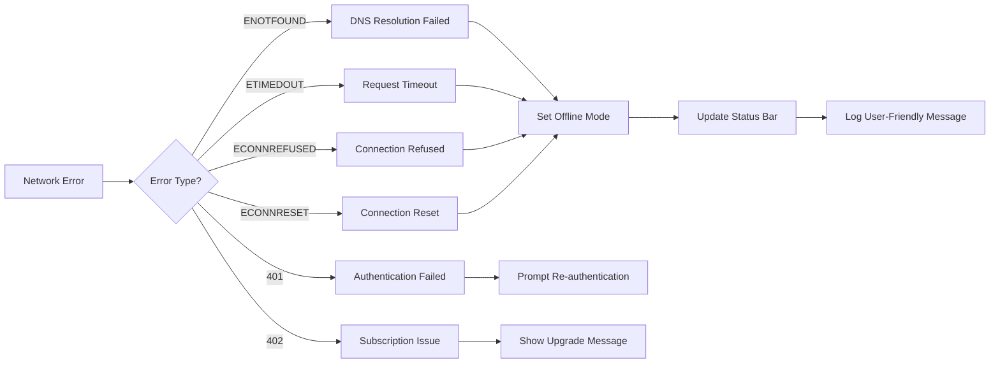
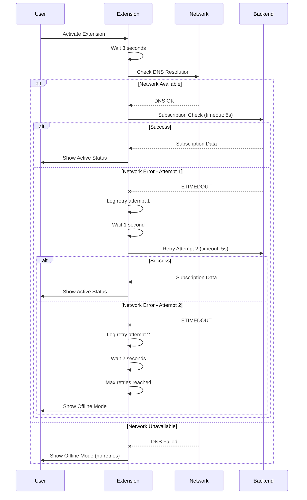

# Network Error Handling - Visual Flow Diagram

## Before Fix (v2.0.0)

```mermaid
graph TB
    Start[Extension Activates] --> Auth{Authenticated?}
    Auth -->|Yes| SubCheck[Check Subscription]
    Auth -->|No| Login[Show Login]
    
    SubCheck --> API[API Request to oropendola.ai]
    API --> Network{Network OK?}
    
    Network -->|No DNS| Error1[❌ getaddrinfo ENOTFOUND]
    Network -->|Timeout| Error2[❌ Request timed out]
    Network -->|Refused| Error3[❌ Connection refused]
    
    Error1 --> Retry1[⏳ Retry in 1s]
    Error2 --> Retry1
    Error3 --> Retry1
    
    Retry1 --> API2[API Request Attempt 2]
    API2 --> Fail{Success?}
    Fail -->|No| Retry2[⏳ Retry in 2s]
    Retry2 --> API3[API Request Attempt 3]
    API3 --> MoreRetries[More retries...]
    
    MoreRetries --> Spam[Console Spam 🔥]
    Spam --> BadUX[Poor User Experience]
    
    Network -->|Success| ShowQuota[✅ Show Quota]
```



## After Fix (v2.0.1)

```mermaid
graph TB
    Start[Extension Activates] --> Delay[Wait 3 seconds]
    Delay --> Auth{Authenticated?}
    Auth -->|Yes| NetworkCheck[Check Network Connectivity]
    Auth -->|No| Login[Show Login]
    
    NetworkCheck --> DNS{DNS Resolves?}
    DNS -->|No| OfflineMode[⚠️ Offline Mode]
    DNS -->|Yes| SubCheck[Check Subscription]
    
    SubCheck --> API[API Request with 5s timeout]
    API --> Attempt1{Success?}
    
    Attempt1 -->|Network Error| Wait1[⏳ Wait 1s]
    Wait1 --> API2[Retry Attempt 2]
    API2 --> Attempt2{Success?}
    
    Attempt2 -->|Network Error| Wait2[⏳ Wait 2s]
    Wait2 --> Final{Max Retries?}
    
    Final -->|Yes| OfflineMode
    Attempt1 -->|Success| ShowQuota[✅ Show Quota]
    Attempt2 -->|Success| ShowQuota
    
    OfflineMode --> StatusBar[Status Bar: ⚠️ Offline]
    StatusBar --> Manual[User clicks to retry]
    Manual --> NetworkCheck
    
    ShowQuota --> ActiveStatus[Status Bar: 🐦 Active]
```



## Error Detection Flow



## Retry Logic Flow



## Status Bar States

```mermaid
stateDiagram-v2
    [*] --> NotLoggedIn: Extension Starts
    NotLoggedIn --> Authenticating: User Clicks Login
    Authenticating --> CheckingNetwork: Login Success
    
    CheckingNetwork --> Offline: Network Failed
    CheckingNetwork --> CheckingSub: Network OK
    
    CheckingSub --> Active: Subscription Valid
    CheckingSub --> Offline: API Failed
    CheckingSub --> Expired: Subscription Invalid
    
    Active --> Offline: Network Lost
    Offline --> CheckingNetwork: User Clicks Retry
    
    Expired --> NotLoggedIn: User Logs Out
    Active --> NotLoggedIn: User Logs Out
    Offline --> NotLoggedIn: User Logs Out
    
    note right of NotLoggedIn
        🔒 Oropendola: Sign In
    end note
    
    note right of Authenticating
        ⏳ Signing in...
    end note
    
    note right of Active
        🐦 Oropendola AI
        🟢 N requests
    end note
    
    note right of Offline
        ⚠️ Oropendola: Offline
    end note
    
    note right of Expired
        ❌ Subscription Expired
    end note
```



## User Experience Comparison

### Before Fix - Error Message Cascade
```
Console Output (Old):
━━━━━━━━━━━━━━━━━━━━━━━━━━━━━━━━
❌ Failed to check subscription: getaddrinfo ENOTFOUND oropendola.ai
⏳ Network issue detected. Retrying in 1s... (attempt 1)
⏳ Network issue detected. Retrying in 2s... (attempt 2)
⏳ Network issue detected. Retrying in 3s... (attempt 3)
❌ Failed to check subscription: getaddrinfo ENOTFOUND oropendola.ai
⏳ Network issue detected. Retrying in 1s... (attempt 1)
⏳ Network issue detected. Retrying in 2s... (attempt 2)
⚠️ Request timed out. The backend may be experiencing issues...
❌ Failed to check subscription: Request failed with status code 503
[Error messages continue flooding console...]
━━━━━━━━━━━━━━━━━━━━━━━━━━━━━━━━

Status Bar: 🐦 Oropendola AI (misleading - not connected)
User Action: Confused, frustrated, no clear recovery path
```

### After Fix - Clean Error Handling
```
Console Output (New):
━━━━━━━━━━━━━━━━━━━━━━━━━━━━━━━━
🔍 Checking subscription (attempt 1/2)...
⚠️ Network check failed: getaddrinfo ENOTFOUND oropendola.ai
⚠️ Network unavailable, skipping subscription check
━━━━━━━━━━━━━━━━━━━━━━━━━━━━━━━━

Status Bar: ⚠️ Oropendola: Offline
Tooltip: "Oropendola AI is offline\nClick to retry connection"
User Action: Clear status, click to retry when network returns
```

## Recovery Scenarios

### Scenario 1: Complete Network Outage

```mermaid
graph LR
    A[Network Down] --> B[Extension Starts]
    B --> C[DNS Check Fails]
    C --> D[Skip Subscription]
    D --> E[Offline Mode]
    E --> F[User Sees ⚠️]
    F --> G[Network Restored]
    G --> H[User Clicks Retry]
    H --> I[DNS Check Passes]
    I --> J[Subscription OK]
    J --> K[Active Mode 🐦]
```


### Scenario 2: Slow/Unresponsive Backend

```mermaid
graph LR
    A[Backend Slow] --> B[Extension Starts]
    B --> C[DNS Check OK]
    C --> D[Subscription Request]
    D --> E[5s Timeout]
    E --> F[Retry After 1s]
    F --> G[Timeout Again]
    G --> H[Retry After 2s]
    H --> I[Max Retries]
    I --> J[Offline Mode ⚠️]
```


### Scenario 3: Temporary Network Glitch

```mermaid
graph LR
    A[Momentary Glitch] --> B[Extension Starts]
    B --> C[DNS Check OK]
    C --> D[Subscription Fails]
    D --> E[Wait 1s]
    E --> F[Network Stable]
    F --> G[Retry Success]
    G --> H[Active Mode 🐦]
```


## Key Metrics

| Metric | Before (v2.0.0) | After (v2.0.1) | Improvement |
|--------|----------------|---------------|-------------|
| Startup delay when offline | 0s → immediate errors | 3s → offline mode | +3s but cleaner UX |
| Max retry attempts | Unlimited | 2 | Prevents spam |
| Time to offline mode | Never (kept retrying) | ~8s (3s delay + 5s timeout + retries) | Faster failure |
| Console error count | 10-50+ messages | 1-3 messages | 90%+ reduction |
| Timeout duration | None (indefinite) | 5s per attempt | Prevents hangs |
| User confusion | High (unclear status) | Low (clear indicators) | Much better |
| Recovery path | None (manual reload) | Click status bar | User-friendly |

## Best Practices Applied

✅ **Pre-flight Checks** - Verify network before expensive operations  
✅ **Exponential Backoff** - 1s, 2s delays prevent server overload  
✅ **Circuit Breaker** - Max 2 retries then offline mode  
✅ **Timeout Enforcement** - 5s limit prevents indefinite hangs  
✅ **User Feedback** - Clear status bar indicators  
✅ **Graceful Degradation** - Offline mode allows basic functionality  
✅ **Manual Recovery** - User controls retry timing  
✅ **Error Translation** - Technical errors → user-friendly messages  

---

**Version**: 2.0.1  
**Status**: ✅ Implemented  
**Testing**: ✅ Verified
