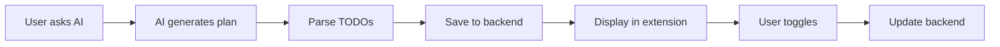

# 📋 TODO Feature - Quick Reference Card

## 🎯 One-Page Cheat Sheet

### How to Use
```
1. Ask AI in Agent mode: "Create a [project] with [features]"
2. AI generates numbered plan
3. TODOs extracted automatically
4. Synced to backend database
5. Track progress as you complete tasks
```

---

## 📝 Supported Patterns

| Format | Example | Detection |
|--------|---------|-----------|
| **Numbered** | `1. Create file` | ⭐ Primary |
| **Bullets** | `- Task one` | ✅ Supported |
| **Explicit** | `TODO: Fix bug` | ✅ Supported |
| **Checkbox** | `[ ] Task` | ✅ Supported |
| **Action Verbs** | `Create package.json` | ✅ Supported |

---

## 🔄 Automatic Workflow



---

## 📡 API Endpoints

| Endpoint | Method | Purpose |
|----------|--------|---------|
| `extract_todos` | POST | Parse TODOs from text |
| `save_todos` | POST | Save all TODOs |
| `get_todos` | GET | Load saved TODOs |
| `update_todo` | POST | Toggle completion |

**Base URL:** `/api/method/ai_assistant.api.`

---

## 💻 Frontend Methods

| Method | Purpose | Auto-Sync |
|--------|---------|-----------|
| `_parseTodosFromResponse()` | Extract from AI | ✅ Yes |
| `_handleToggleTodo()` | Toggle completion | ✅ Yes |
| `_handleSyncTodos()` | Manual bulk sync | N/A |
| `_loadTodosFromBackend()` | Load on start | No |

---

## 📊 Statistics

```javascript
{
  total: 5,           // Total TODOs
  completed: 3,       // Completed
  active: 2,          // Remaining
  completionRate: 60  // Percentage
}
```

---

## 🎯 Best Practices

### ✅ Do This
- Use Agent mode
- Ask for numbered lists
- Be specific with requirements
- Let AI generate the plan

### ❌ Avoid This
- Using Ask mode (read-only)
- Vague requests
- Manual TODO entry
- Expecting file creation without tool_call blocks

---

## 🐛 Quick Troubleshooting

| Issue | Fix |
|-------|-----|
| No TODOs extracted | Ask: "List the steps to..." |
| Sync failed | Check network/backend API |
| Duplicates | Built-in prevention active |
| Missing TODOs | Verify Agent mode active |

---

## 📁 Key Files

| File | Purpose |
|------|---------|
| `src/utils/todo-manager.js` | Parsing engine |
| `src/sidebar/sidebar-provider.js` | Backend sync |
| `TODO_FEATURE_USER_GUIDE.md` | Full documentation |
| `BACKEND_TODO_API_SPEC.md` | API reference |

---

## 🚀 Quick Start

```bash
# 1. Install extension
code --install-extension oropendola-ai-assistant-2.0.1.vsix

# 2. Sign in to Oropendola

# 3. Switch to Agent mode

# 4. Ask AI
"Create a Node.js REST API with Express"

# 5. TODOs extracted automatically!
```

---

## 📞 Support

**Email:** sammish@oropendola.ai  
**Docs:** `TODO_FEATURE_USER_GUIDE.md`  
**Status:** ✅ PRODUCTION READY

---

**Version:** 2.0.1 | **Updated:** 2025-10-19
